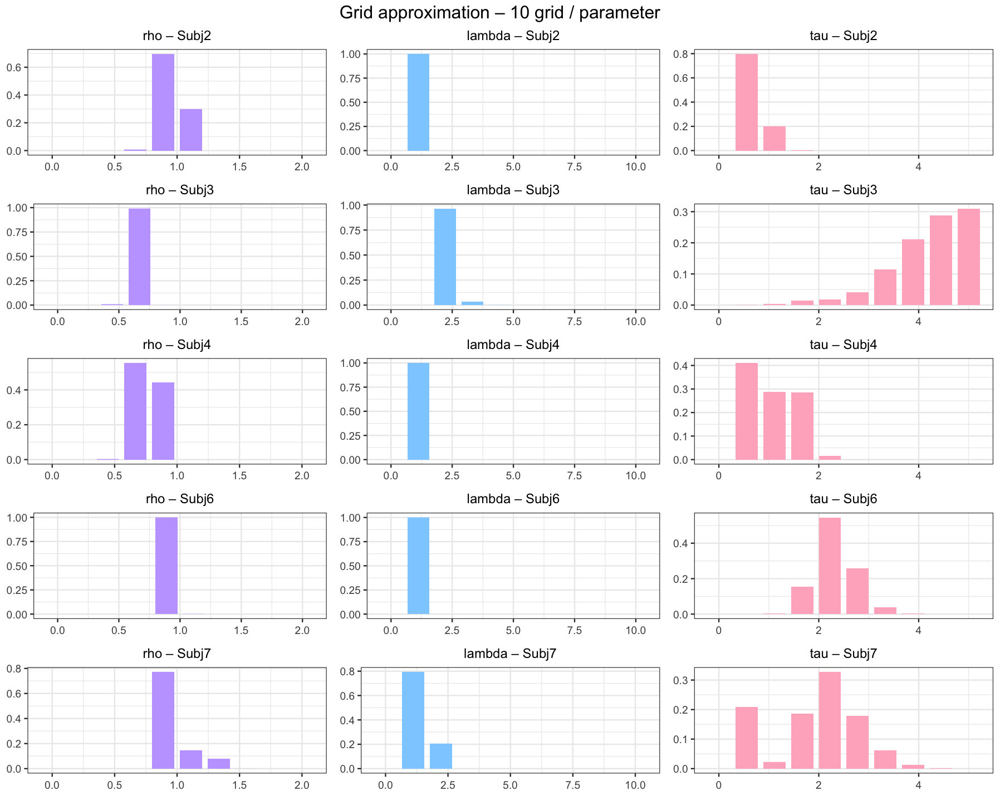
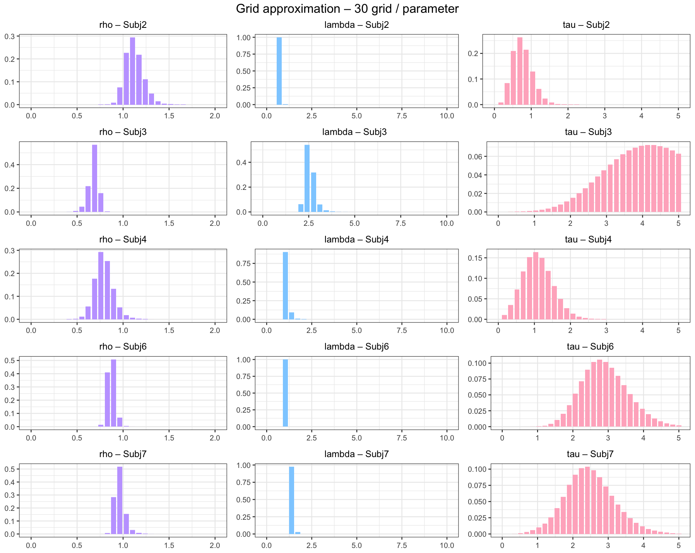

```{r setup, include=FALSE}

# if (!require(tidyverse)) install.packages('tidyverse')
# if (!require(gridExtra)) install.packages('gridExtra')
# if (!require(knitr)) install.packages('knitr')
# if (!require(kableExtra)) install.packages('kableExtra')
# if (!require(rstan)) install.packages('rstan')
# if (!require(hBayesDM)) install.packages('hBayesDM')

library(tidyverse)
library(dplyr)
library(gridExtra)
library(knitr)
library(kableExtra)
library(rstan)
library(hBayesDM)
library(cowplot)
library(ggplot2)

knitr::opts_chunk$set(echo = FALSE, warning = FALSE, message = FALSE,
                      fig.width = 3, fig.height = 3, fig.align = "center")
```

```{r functions}
# function for drawing posterior distribution 
draw.post_dist <- function(output, pars){
  p <- stan_plot(output, show_density = T, pars = pars, ci_level = 0.95, outer_level = 1) +
    labs(title = pars) + 
    theme(plot.title = element_text(face ='bold'))
  return(p)
}
```


# Q1.
## (1)
1. run `simulate_hw6_model1.R` and create `simul_data_hw6_model1.txt`
2. See codes in `Q1` folder
```{r}
#setwd
setwd("~/Documents/GitHub/2026_Computational-Modeling/HW6/HW6_solutions")

# load the output 
load('Q1/output_Q1.RData')

# extract parameter values 
parameters <- rstan::extract(output_Q1)
```

## (2a) 
## Posterior distributions of group-level parameters
```{r, fig.width=4, fig.height=3}
# group-level parameters
p1 <- draw.post_dist(output_Q1, c('mu_alpha', 'mu_beta', 'sigma')) + 
  labs(title = 'group-level parameters')
p1
```

## Posterior distributions of individual-level parameters
```{r, fig.width=10, fig.height=10, out.width="100%"}

# individual-level parameters
p1 <- draw.post_dist(output_Q1, 'alpha')
p2 <- draw.post_dist(output_Q1, 'beta')

grid.arrange(p1, p2, ncol = 2)
```
\pagebreak 

## (2b) Scatterplot of true parameters and estimated parameters
```{r, fig.width=4.5, fig.height=4.5}
# load true parameters of the simulated data
load('Q1/simul_pars_Q1Q2.RData')

# get posterior mean of each individual-level parameters
alpha_mean = apply(parameters$alpha, 2, mean)
alpha_sd = apply(parameters$alpha, 2, sd)
beta_mean = apply(parameters$beta, 2, mean)
beta_sd = apply(parameters$beta, 2, sd)

# draw scatterplot 
plot(simul_pars$alpha, alpha_mean, xlim=c(0, 0.5), ylim=c(0, 0.5)); abline(0,1)
arrows(x0=simul_pars$alpha, y0= alpha_mean - alpha_sd, y1= alpha_mean + alpha_sd, length=0.02, angle=90, code=3)

plot(simul_pars$beta, beta_mean, xlim=c(0, 4), ylim=c(0, 4)); abline(0,1)
arrows(x0=simul_pars$beta, y0=beta_mean-beta_sd, y1=beta_mean+beta_sd, length=0.05, angle=90, code=3)

```
\pagebreak


# Q2
## (1) Posterior distributions of the non-hierarchical model
see codes in `Q2` folder 
```{r}
# load the output 
load('Q2/output_Q2.RData')

# extract parameter values 
parameters <- rstan::extract(output_Q2)
```
 
```{r, fig.width=10, fig.height=10, out.width="100%"}
# individual-level parameters
p1 <- draw.post_dist(output_Q2, 'alpha')
p2 <- draw.post_dist(output_Q2, 'beta')

grid.arrange(p1, p2, ncol = 2)
```

## (2) Scatterplot of true parameters and estimated parameters
```{r, fig.width=4.5, fig.height=4.5}
# get posterior mean of each individual-level parameters
alpha_mean = apply(parameters$alpha, 2, mean)
alpha_sd = apply(parameters$alpha, 2, sd)
beta_mean = apply(parameters$beta, 2, mean)
beta_sd = apply(parameters$beta, 2, sd)

# draw scatterplot 
plot(simul_pars$alpha, alpha_mean, xlim=c(0, 0.5), ylim=c(0, 0.5)); abline(0,1)
arrows(x0=simul_pars$alpha, y0= alpha_mean - alpha_sd, y1= alpha_mean + alpha_sd, length=0.02, angle=90, code=3)

plot(simul_pars$beta, beta_mean, xlim=c(0, 4), ylim=c(0, 4)); abline(0,1)
arrows(x0=simul_pars$beta, y0=beta_mean-beta_sd, y1=beta_mean+beta_sd, length=0.05, angle=90, code=3)
```

## (3) Noticeable difference between Q1 vs. Q2? 
The scatterplots of the hierarchical model (Q1) are more concentrated and the results of parameter recovery are better than those of the non-hierarchicl model (Q2). This difference is due to the shrinkage 
\pagebreak


# Q3
## (1) 
1. For simulation, see `simulate_hw7_model2.R`
2. For parameter estimation, see codes in `Q3` folder
```{r}
# load the output 
load('Q3/output_Q3.RData')

# extract parameter values 
parameters <- rstan::extract(output_Q3)
```

## (2) Posterior distributions
## Posterior distributions of group-level parameters
```{r, fig.width=4, fig.height=3}
# group-level parameters
p1 <- draw.post_dist(output_Q3, c('mu_alpha', 'mu_beta', 'sigma')) + 
  labs(title = 'group-level parameters')
p1
```

## Posterior distributions of individual-level parameters
```{r, fig.width=10, fig.height=13, out.width="100%"}
# individual-level parameters
p1 <- draw.post_dist(output_Q3, 'alpha')
p2 <- draw.post_dist(output_Q3, 'beta')

grid.arrange(p1, p2, ncol = 2)
```
\pagebreak 

## (3) Scatterplot of true parameters and estimated parameters
```{r, fig.width=4.5, fig.height=4.5}
# load true parameters of the simulated data
load('Q3/simul_pars_Q3.RData')

# get posterior mean of each individual-level parameters
alpha_mean = apply(parameters$alpha, 2, mean)
alpha_sd = apply(parameters$alpha, 2, sd)
beta_mean = apply(parameters$beta, 2, mean)
beta_sd = apply(parameters$beta, 2, sd)

# draw scatterplot 
plot(simul_pars$alpha, alpha_mean, xlim=c(0, 0.5), ylim=c(0, 0.5)); abline(0,1)
arrows(x0=simul_pars$alpha, y0= alpha_mean - alpha_sd, y1= alpha_mean + alpha_sd, length=0.02, angle=90, code=3)

plot(simul_pars$beta, beta_mean, xlim=c(0, 4), ylim=c(0, 4)); abline(0,1)
arrows(x0=simul_pars$beta, y0=beta_mean-beta_sd, y1=beta_mean+beta_sd, length=0.05, angle=90, code=3)
```

## (4) Reason for the difference in shrinkage between parameters?
As can be seen in the scatterplots, the estimation of the individual parameter alpha seems to be more shrinked
toward the value of mu_alpha than parameter beta. This is because the degree of shrinkage is greater for small coefficients compared to large coefficients. 

\pagebreak


# Q4
## (1) 
1. For simulation, `simulate_Q4.R`.
2. For parameter estimation, see `hw6_Q4.R` & `hw6_Q4.stan` in `Q4` folder.

```{r}
# load the output 
load('Q4/output_Q4.RData')
# extract parameter values 
parameters <- rstan::extract(output_Q4)
```

## Posterior distributions of group-level parameters
```{r, fig.width=4, fig.height=3}
# group-level parameters
p1 <- draw.post_dist(output_Q4, c('mu_alpha_pos', 'mu_alpha_neg', 'mu_beta', 'sigma')) + 
  labs(title = 'group-level parameters')
p1
```

## Posterior distributions of individual-level parameters
```{r, fig.width=10, fig.height=10, out.width="100%"}
# individual-level parameters
p1 <- draw.post_dist(output_Q4, 'alpha_pos')
p2 <- draw.post_dist(output_Q4, 'alpha_neg')
p3 <- draw.post_dist(output_Q4, 'beta')

grid.arrange(p1, p2, p3, ncol = 3)
```
\pagebreak 

## (2) Scatterplot of true parameters and estimated parameters
```{r, fig.width=4.5, fig.height=4.5}
# load true parameters of the simulated data
load('Q4/simul_pars_Q4.RData')

# get posterior mean of each individual-level parameters
alpha_pos_mean = apply(parameters$alpha_pos, 2, mean)
alpha_pos_sd = apply(parameters$alpha_pos, 2, sd)
alpha_neg_mean = apply(parameters$alpha_neg, 2, mean)
alpha_neg_sd = apply(parameters$alpha_neg, 2, sd)
beta_mean = apply(parameters$beta, 2, mean)
beta_sd = apply(parameters$beta, 2, sd)

# draw scatterplot 
plot(simul_pars$alpha_pos, alpha_pos_mean, xlim=c(0, 0.5), ylim=c(0, 0.5)); abline(0,1)
arrows(x0=simul_pars$alpha_pos, y0= alpha_pos_mean - alpha_pos_sd, y1= alpha_pos_mean + alpha_pos_sd, length=0.02, angle=90, code=3)

plot(simul_pars$alpha_neg, alpha_neg_mean, xlim=c(0, 0.5), ylim=c(0, 0.5)); abline(0,1)
arrows(x0=simul_pars$alpha_neg, y0= alpha_neg_mean - alpha_neg_sd, y1= alpha_neg_mean + alpha_neg_sd, length=0.02, angle=90, code=3)

plot(simul_pars$beta, beta_mean, xlim=c(0, 4), ylim=c(0, 4)); abline(0,1)
arrows(x0=simul_pars$beta, y0=beta_mean-beta_sd, y1=beta_mean+beta_sd, length=0.05, angle=90, code=3)
```

## (3) 
1. For simulation, see `simulate__hw7_model4_Q4_2.R`.
2. For parameter estimation, see `hw6_Q4_2.R` & `hw6_Q4.stan` in `Q4` folder.

```{r}
# load the output 
load('Q4/output_Q4_2.RData')

# extract parameter values 
parameters <- rstan::extract(output_Q4_2)
```

## Posterior distributions of group-level parameters
```{r, fig.width=4, fig.height=3}
# group-level parameters
p1 <- draw.post_dist(output_Q4_2, c('mu_alpha_pos', 'mu_alpha_neg', 'mu_beta', 'sigma')) + 
  labs(title = 'group-level parameters')
p1
```

## Posterior distributions of individual-level parameters
```{r, fig.width=10, fig.height=10, out.width="100%"}
# individual-level parameters
p1 <- draw.post_dist(output_Q4_2, 'alpha_pos')
p2 <- draw.post_dist(output_Q4_2, 'alpha_neg')
p3 <- draw.post_dist(output_Q4_2, 'beta')

grid.arrange(p1, p2, p3, ncol = 3)
```
\pagebreak 

## Scatterplot of true parameters and estimated parameters
```{r, fig.width=4.5, fig.height=4.5}
# load true parameters of the simulated data
load('Q4/simul_pars_Q4_2.RData')

# get posterior mean of each individual-level parameters
alpha_pos_mean = apply(parameters$alpha_pos, 2, mean)
alpha_pos_sd = apply(parameters$alpha_pos, 2, sd)
alpha_neg_mean = apply(parameters$alpha_neg, 2, mean)
alpha_neg_sd = apply(parameters$alpha_neg, 2, sd)
beta_mean = apply(parameters$beta, 2, mean)
beta_sd = apply(parameters$beta, 2, sd)

# draw scatterplot 
plot(simul_pars$alpha_pos, alpha_pos_mean, xlim=c(0, 0.5), ylim=c(0, 0.5)); abline(0,1)
arrows(x0=simul_pars$alpha_pos, y0= alpha_pos_mean - alpha_pos_sd, y1= alpha_pos_mean + alpha_pos_sd, length=0.02, angle=90, code=3)

plot(simul_pars$alpha_neg, alpha_neg_mean, xlim=c(0, 0.5), ylim=c(0, 0.5)); abline(0,1)
arrows(x0=simul_pars$alpha_neg, y0= alpha_neg_mean - alpha_neg_sd, y1= alpha_neg_mean + alpha_neg_sd, length=0.02, angle=90, code=3)

plot(simul_pars$beta, beta_mean, xlim=c(0, 4), ylim=c(0, 4)); abline(0,1)
arrows(x0=simul_pars$beta, y0=beta_mean-beta_sd, y1=beta_mean+beta_sd, length=0.05, angle=90, code=3)
```


## (4) Difference between Q4(2) vs. Q4(3)? 

Q4(3) showed better parameter recovery results than Q4(2), for the alpha parameters. One reason could be the increase in the number of trials in Q4(3), which increases the information for each individual. The low estimation accuracy of `alpha_neg` is a consequence of setting relatively high `pr_correct` in Q4(2) compared to Q4(3). Thus, there was relatively smaller information for negative PE in Q4(2) while positive and negative PE were fairly well distributed in Q4(3). 


\pagebreak 
# Q3
## (1) Grid approximation and posterior distributions of the ra_prospect model - 10 Grids

```{r q3_tab10, echo=FALSE, message=FALSE}
tab10 <- read.csv("Q5/posterior_means_grid10.csv")
knitr::kable(tab10,
             format      = "latex",
             booktabs    = TRUE,
             digits      = 3,
             caption     = "Posterior means (10-grid)",
             align       = "c") %>% 
  kableExtra::kable_styling(position = "center",
                            latex_options = c("HOLD_position"))


```

## (2) Grid approximation and posterior distributions of the ra_prospect model - 30 Grids

```{r q3_tab30, echo=FALSE, message=FALSE}
tab30 <- read.csv("Q5/posterior_means_grid30.csv")
knitr::kable(tab30,
             format      = "latex",
             booktabs    = TRUE,
             digits      = 3,
             caption     = "Posterior means (30-grid)",
             align       = "c") %>% 
  kableExtra::kable_styling(position = "center",
                            latex_options = c("HOLD_position"))


```
